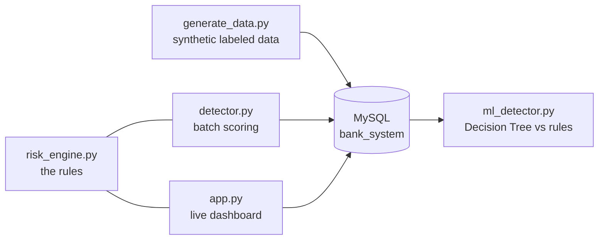

# FraudGuard: transaction fraud detection

A rule-based fraud scoring engine for bank transactions, with a live dashboard and a Decision Tree used to check how good the rules are.

Every transaction is scored on six signals, gets a decision (approved, flagged or blocked), and the reasons are saved with it, so a reviewer can see why a transaction was stopped.

## What it does

- **Scores each transaction** with a rule engine and saves the score, status and plain-English reasons to MySQL.
- **Batch mode** (`detector.py`) scores all pending transactions, highest risk first, using a heap as a priority queue.
- **Live mode** (`app.py`) is a Flask dashboard: submit a transaction and see it scored immediately.
- **Evaluation** (`ml_detector.py`) trains a Decision Tree on labeled data and compares it with the rules on the same test rows.
- **Tests:** 33 unit tests cover every rule and its boundaries.

## How it works



### The rules

| Rule | Condition | Points |
|---|---|---|
| High amount | amount of 10,000 or more | 3 |
| Night-time | between 23:00 and 05:59 | 2 |
| Unusual amount | more than 3x the account's average | 3 |
| New account | account younger than 48 hours | 2 |
| Impossible travel | more than 500 km in under 60 min, or more than 100 km in under 15 min, compared with the sender's previous transaction | 5 |
| Velocity | more than 2 transactions within 1 minute | 4 |

**Decision:** score of 6 or more is **BLOCKED**, 3 to 5 is **FLAGGED** for review, below 3 is **APPROVED**. All thresholds are named constants at the top of `risk_engine.py`.

## Results

Data: 685 synthetic transactions, 149 labeled fraud (21.8%). The fraud label (`is_fraud`) is generated separately from the rules, and the tree never sees the rule score or status.

Mean and standard deviation over 10 random 75/25 splits (about 172 test rows each). The rules count FLAGGED and BLOCKED as "fraud".

| Method | Precision | Recall | F1 |
|---|---|---|---|
| Rule engine | 0.80 ± 0.04 | 0.85 ± 0.05 | 0.83 ± 0.04 |
| Decision Tree (depth 4) | 0.82 ± 0.05 | 0.84 ± 0.04 | 0.83 ± 0.04 |

What I take from this:

- **The tree does not beat the rules.** They score the same. That is expected, because the synthetic fraud follows the same patterns the rules look for.
- **Tree depth barely matters.** Depths 2 to 6 all give an F1 of 0.82 to 0.83.
- **Amount relative to the account's average was the most important feature** for the tree (importance 0.78).
- The tree's learned if/else rules, the transactions where the two methods disagree, and the full output are in [`ml_results.txt`](ml_results.txt).

## Design decisions

- **One rule engine, used everywhere.** `risk_engine.py` has no database code, so the batch scorer and the dashboard share the same rules and the rules are easy to unit test.
- **Honest evaluation.** Labels come from the data generator, not from the rules. The tree is trained without the rule score, so it cannot copy the rules.
- **Explainable output.** Each decision stores the reasons that produced it.
- **Time-based rules use the transaction's own timestamp**, not the current time, so they also work on historical data.
- **Duplicate rows are removed** before the train/test split, so the same transaction cannot appear in both sets.

## Limitations

- **The data is synthetic.** The results show the pipeline works, not how it would do on real transactions.
- **Some fraud is undetectable by design.** A small share of the fraud (small amount, normal hour, home city) looks identical to a normal transaction, so both methods miss it.
- **The rules cannot tell a large late-night payment (rent, tuition) from fraud**, so some legitimate transactions are stopped.
- **The travel rule compares against the sender's previous transaction whatever its status**, so a legitimate transaction that follows a fraudulent one in another city can be scored as impossible travel.
- **The velocity rule only fires on the third transaction in a minute**, so the first two in a burst are not caught by it.
- **Distances come from a small hard-coded table** covering four cities.
- **Thresholds were picked by hand.** The test set is small, which is why results are averaged over 10 splits.
- Transactions entered through the dashboard are stored with `is_fraud = 0`. Re-run `generate_data.py` before evaluating.

## Run it

**Requirements:** Python 3.10 or newer and MySQL 8.

```bash
git clone https://github.com/harshada-chavan15/Fraud-detection-system.git
cd Fraud-detection-system
python -m pip install -r requirements.txt
```

1. **Create the database and tables:** `mysql -u root -p < schema.sql`
2. **Add your settings:** copy `.env.example` to `.env` and put your MySQL password in it.
3. **Generate data:** `python generate_data.py` (this clears existing transactions first).
4. **Score everything:** `python detector.py` (use `--rescore` to score again after changing a threshold).
5. **Open the dashboard:** `python app.py`, then visit http://127.0.0.1:5000
6. **Compare with a Decision Tree:** `python ml_detector.py`
7. **Run the tests:** `python -m pytest -v`

## Project structure

```
risk_engine.py     rules and decision logic (no database code)
detector.py        batch scorer with a heap-based review queue
app.py             Flask dashboard, scores each new transaction
ml_detector.py     features, Decision Tree, comparison with the rules
generate_data.py   synthetic data with independent fraud labels
config.py          loads settings from .env
schema.sql         database tables
templates/         dashboard page
tests/             unit tests for the rule engine
```

## Tech

Python, MySQL, Flask, pandas, scikit-learn, pytest.
